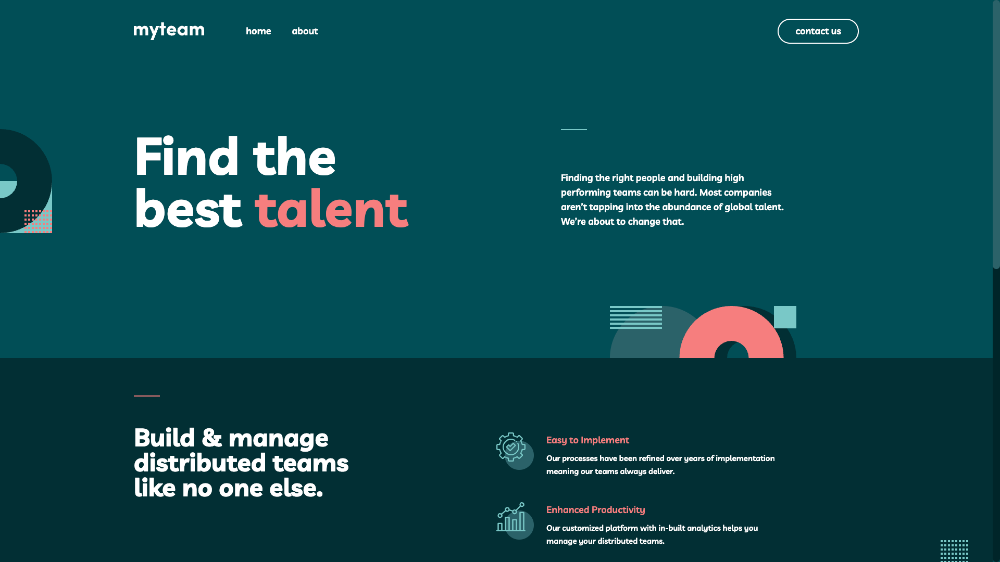

# 🚀 My Team – Multi-Page Website

This is a solution to
the [My Team Website challenge on Frontend Mentor](https://www.frontendmentor.io/challenges/myteam-multipage-website-mxlEauvW).
Frontend Mentor challenges help you improve your coding skills by building realistic projects.

---

## ✅ Table of contents

- [Overview](#-overview)
    - [The challenge](#the-challenge)
    - [Screenshots](#screenshots)
    - [Links](#links)
- [My process](#-my-process)
    - [Built with](#built-with)
    - [What I learned](#what-i-learned)
    - [Useful resources](#useful-resources)
- [Author](#-author)

---

## 💡 Overview

### The challenge

Users should be able to:

- View the optimal layout for each page depending on their device's screen size
- See hover states for all interactive elements throughout the site
- See the correct content for each team member on the About page when the `+` icon is clicked
- Receive an error message when the contact form is submitted if:
    - The `Name`, `Email Address` or `Message` fields are empty should show `"This field is required"`
    - The `Email Address` is not formatted correctly should show `"Please use a valid email address"`

### Screenshots

...

 
  
  <em>desktop version</em>

 
  
  <em>mobile version</em>

### Links

- Solution URL: [GitHub](https://github.com/jakubjirous/my-team-multi-page-website/)
- Live Site URL: [Vercel](https://my-team-multi-page-website-jakubjirous.vercel.app/)

---

## 🎯 My process

### Built with

- Semantic HTML5 markup
- CSS custom properties
- Flexbox
- CSS Grid
- Mobile-first workflow
- [Next.js](https://nextjs.org/) – React framework
- [React](https://reactjs.org/) – JS library
- [React Hook Form](https://react-hook-form.com/) – For form state management
- [Tailwind CSS](https://tailwindcss.com/) – For styles

### What I learned

...

### Useful resources

- [Next.js Documentation](https://beta.nextjs.org/docs)
- [React Documentation](https://beta.reactjs.org/)
- [React Hook Form Documentation](https://react-hook-form.com/get-started)
- [Tailwind CSS Documentation](https://tailwindcss.com/docs/installation)
    - [Quick reference](https://tailwindcss.com/docs/hover-focus-and-other-states#quick-reference)
    - [Customizing Screens](https://tailwindcss.com/docs/screens)
    - [Functions & Directives](https://tailwindcss.com/docs/functions-and-directives)
    - [Default configuration](https://github.com/tailwindlabs/tailwindcss/blob/master/stubs/defaultConfig.stub.js)
    - [Default spacing scale](https://tailwindcss.com/docs/customizing-spacing#default-spacing-scale)

---

## 👨‍💻 Author

- Website – [www.jakubjirous.cz](https://www.jakubjirous.cz)
- Frontend Mentor – [@jakubjirous](https://www.frontendmentor.io/profile/jakubjirous)
- LinkedIn – [jakubjirous](https://www.linkedin.com/in/jakubjirous/)
